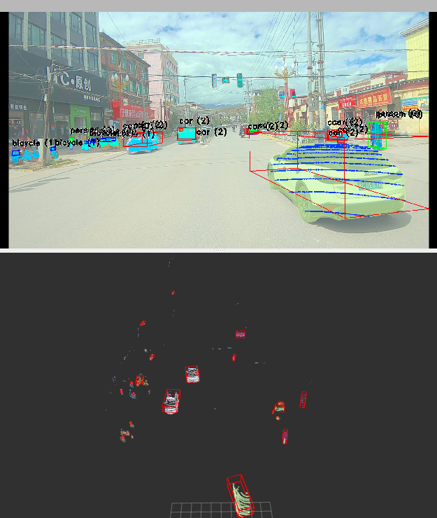

***
# 说明
此工程用于实现ROS1下用TensorRT部署YOLOV11模型实现对image图像的2D目标分割，并与3Dlidar点云融合形成3D目标感知<br>

***
# 环境准备
* CUDA
* TensorRT 8 或 TensorRT 10
* TensorRT OSS 对应你的TensorRT版本
* 准备自己的yolov11分割模型 https://docs.ultralytics.com/models/yolo11/#segmentation-coco
***
# Step1
修改CMakeLists文件以适配你的CUDA，TensorRT系统环境
***
# Step2
修改`include/yolo_pointcloud_detect`文件夹下`config.h`文件用于适配你的onnx模型<br>
修改`cfg/params.yaml`文件以对应你的话题名称，内外参参数，地面分割参数等<br>
Tensorrt10版本下确认你的onnx输入，输出层name，来正确填入`src/yolo_infer/infer.cpp`中`const char* inputName`和`const char* outputName`变量
！！！应特别注意，由于分割模型是双输出，一定保证`outputName1`,`protoOutDims`,`vBufferD[1]`是对应的mask输出，`outputName2`，`outputSize`, `vBufferD[2]`对应目标检测的输出<br>
***
# Step3
```bash
catkin_make
source devel/setup.bash
```
***
# Step4
发布你的图像话题，点云话题（注意时间同步）
***
# Step5
```bash
roslaunch yolo_pointcloud_detect run.launch #初次运行会在生成.plan文件后才执行推理
```
***